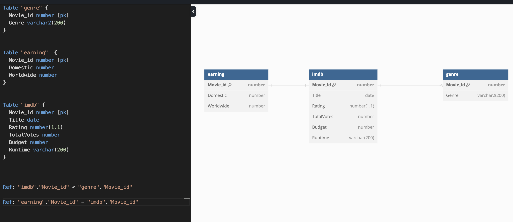
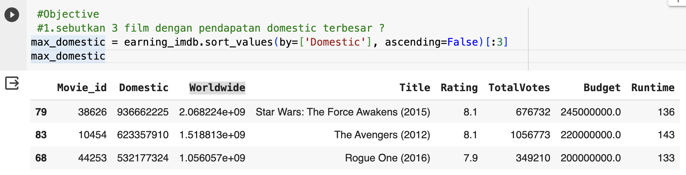
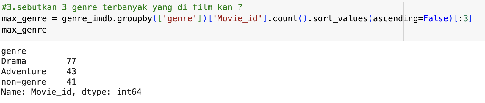
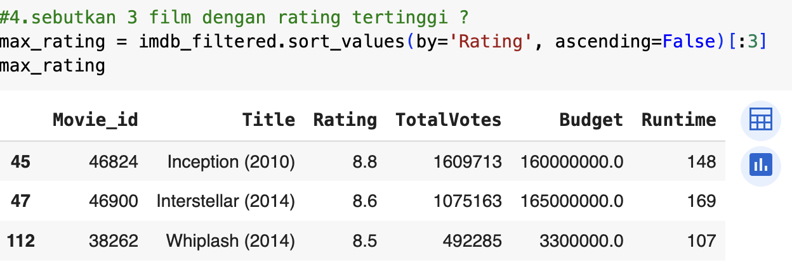
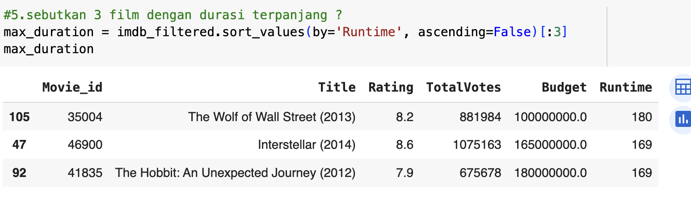
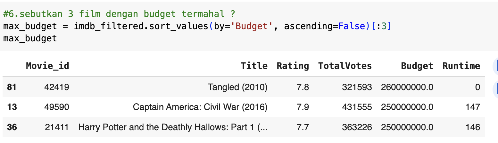
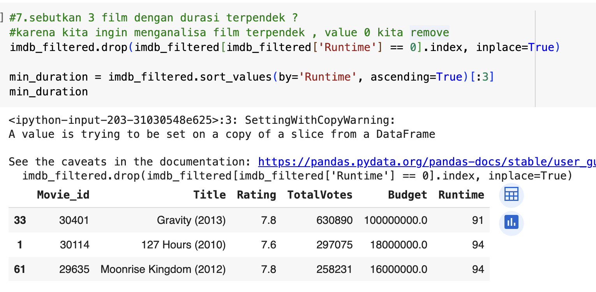

# Wrangling & Sql Project

data wrangling used python as main programming language, sqlite database for source of data

### A. Requirement
-  Clear The Objective ✅
-  Dataset ✅
-  Exploratory Data Analysis ✅
-  Source Code with Jupiter Notebook ✅
-  Data analysis ✅
-  Answer The Objective ✅
-  Documentation ✅
-  Presentation ✅

### B. Objective
1. sebutkan 3 film dengan pendapatan domestic terbesar ?
2. sebutkan 3 film dengan pendapatan international terbesar ?
3. sebutkan 3 genre terbanyak yang di film kan ?
4. sebutkan 3 film dengan rating tertinggi ?
5. sebutkan 3 film dengan durasi terpanjang ?
6. sebutkan 3 film dengan budget termahal ?
7. sebutkan 3 film dengan durasi terpendek ?

### C. Dataset
Sumber data saya dapatkan melalui website _kaggle_, https://www.kaggle.com/datasets/shahjhanalam/movie-data-analytics-dataset

_Picture 1: ERD for movies DB_

### D. Exploratory Data Analysis
- check is nan on 3 tables
- check empty string value on 3 tables
- imputing to default value
- check outlier 

### E. Data Analysis

- use filtering on dataframe
- use groupby and count value

### F. Result 
1. sebutkan 3 film dengan pendapatan domestic terbesar ?
 
 

_Picture 2: objective 1_

2. sebutkan 3 film dengan pendapatan international terbesar ?

 

_Picture 3: objective 2_

3. sebutkan 3 genre terbanyak yang di film kan ?

 

_Picture 4: objective 3_

4. sebutkan 3 film dengan rating tertinggi ?

 

_Picture 5: objective 4_

5. sebutkan 3 film dengan durasi terpanjang ?

 

_Picture 6: objective 5_

6. sebutkan 3 film dengan budget termahal ?

 

_Picture 7: objective 6_

7. sebutkan 3 film dengan durasi terpendek ?

 

_Picture 8: objective 7_

